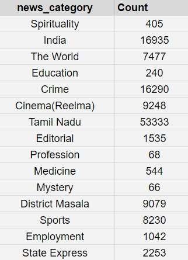
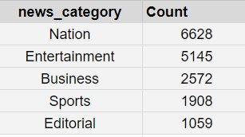
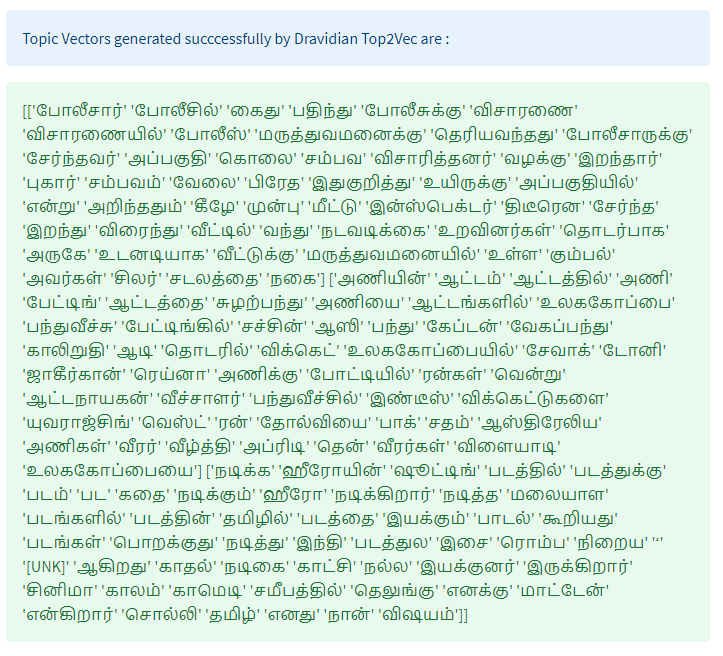

# Dravidian_Top2Vec
Top2Vec language modelling on Tamil and Telugu news data

[](https://pypi.org/project/top2vec/)
[](https://github.com/bindusri0702/Dravidian_Top2Vec/blob/main/LICENSE)


<a name="readme-top"></a>

<!-- TABLE OF CONTENTS -->
<details>
  <summary>Table of Contents</summary>
  <ol>
    <li>
      <a href="#about-the-project">About The Project</a>
      <ul>
        <li><a href="#top2vec">Top2Vec</a></li>
      </ul>
    </li>
    <li>
      <a href="#getting-started">Getting Started</a>
      <ul>
        <li><a href="#prerequisites">Prerequisites</a></li>
        <li><a href="#UMAP">UMAP</a></li>
        <li><a href="#HDBSCAN">HDBSCAN</a></li>
      </ul>
    </li>
    <li><a href="#embedding">Embedding Models</a></li>
    <li><a href="#tokenizers">Tokenizers</a></li>
    <li><a href="#tamil">Top2Vec on Tamil news articles</a></li>
    <li><a href="#telugu">Top2Vec on Telugu news articles</a></li>
    <li><a href="#kannada">Top2Vec on Kannada news articles</a></li>
    <li><a href="#malayalam">Top2Vec on Malayalam news articles</a></li>
    <li><a href="#streamlit">Streamlit GUI</a></li>
    <li><a href="#references">References</a></li>
  </ol>
</details>

<!-- ABOUT THE PROJECT -->
## About The Project
Top2Vec is an algorithm for **topic modeling** and **semantic search**. It automatically detects topics present in text
and generates jointly embedded topic, document and word vectors. Once you train the Top2Vec model 
you can:
* Get number of detected topics.
* Get topics.
* Get topic sizes. 
* Get hierarchichal topics. 
* Search topics by keywords.
* Search documents by topic.
* Search documents by keywords.
* Find similar words.
* Find similar documents.
* Expose model with [RESTful-Top2Vec](https://github.com/ddangelov/RESTful-Top2Vec)

See the [paper](http://arxiv.org/abs/2008.09470) for more details on how it works.

Benefits
--------
1. Automatically finds number of topics.
2. No stop word lists required.
3. No need for stemming/lemmatization.
4. Works on short text.
5. Creates jointly embedded topic, document, and word vectors. 
6. Has search functions built in.

This project focuses on the basic functions of Top2Vec like number of detected topics and name of topics detected for dravidian languages.

<p align="center">
  
</p>
<h3 align="center">Dravidian - Top2Vec</h3>

<p align="right">(<a href="#readme-top">back to top</a>)</p>

## Getting Started

In this growing digital era, with the rapid increase in technology, data has also been growing. Organizing, searching and summarising large collections of text is a ubiquitous problem. To make this strenuous task possible, Topic modelling is used. Topic modelling is usually used on a large collection of data where organization and summarization of data cannot be done manually.This project is about identifying topic vectors by using joint document and word semantic embedding in Dravidian languages.With this paradigm, the number of topics is automatically determined without the need for stop-word lists, stemming, or lemmatization. The topic vectors that come from this are jointly embedded with the
word and document vectors, with the distance between them signifying semantic similarity.

### Prerequisites

Installation of required packages

* umap
  ```sh
  pip uninstall umap
  ```
* umap-learn
  ```sh
  pip install umap-learn
  ```
* gensim
  ```sh
  pip install gensim==4.2.0
  ```
* joblib
```sh
pip install joblib==1.1.0
```
* hdbscan
```sh
pip install hdbscan
```
* transformers
```sh
pip install transformers
```
* sentence-transformers
```sh
pip install -U sentence-transformers
```
<p align="right">(<a href="#readme-top">back to top</a>)</p>

### Uniform Manifold Approximation and Projection - UMAP

Create lower dimensional embedding of document vectors using UMAP.

Document vectors in high dimensional space are very sparse, dimension reduction helps for finding dense areas. Each point is a document vector. 
UMAP compared to t-SNE etc., preserves global structure and scales large datasets well.

### Hierarchical Density-Based Spatial Clustering of Applications with Noise - HDBSCAN

Find dense areas of documents using HDBSCAN. Each cluster represents a topic.

<p align="right">(<a href="#readme-top">back to top</a>)</p>

### Embedding Models

Dravidian Top2Vec is trained on many embedding models. These are some of the models that shown better performance -

muril_base = 'https://huggingface.co/google/muril-base-cased'

muril_large = 'https://huggingface.co/google/muril-large-cased'

indic_bert = 'https://huggingface.co/ai4bharat/indic-bert'

opus = 'https://huggingface.co/Helsinki-NLP/opus-mt-en-dra'

<p align="right">(<a href="#readme-top">back to top</a>)</p>

### Tokenizers

Custom tokenizer is built to deal with dravidian languages. Dravidian Top2Vec showed better performance with following tokenizers -

muril_base = AutoTokenizer.from_pretrained('google/muril-base-cased')

muril_large = AutoTokenizer.from_pretrained('google/muril-large-cased')

indic_bert = AutoTokenizer.from_pretrained('ai4bharat/indic-bert')

opus = AutoTokenizer.from_pretrained('Helsinki-NLP/opus-mt-en-dra')

<p align="right">(<a href="#readme-top">back to top</a>)</p>

### Top2Vec on Tamil news articles

Dataset used - [tamil_data](https://www.kaggle.com/datasets/vijayabhaskar96/tamil-news-classification-dataset-tamilmurasu)

<p align="center">
  
</p>
<h3 align="center">Tamil - Data</h3>

Topic words found using above embedding models and tokenizers - [tamil_results](https://docs.google.com/spreadsheets/d/1Nqb7UjVDgSAnLkm48jLlgWN-KBNk-By8awnnud9e5NA/edit?usp=sharing)

<p align="right">(<a href="#readme-top">back to top</a>)</p>

### Top2Vec on Telugu news articles

Dataset used - [telugu_data](https://www.kaggle.com/datasets/sudalairajkumar/telugu-nlp)

<p align="center">
  
</p>
<h3 align="center">Telugu - Data</h3>

Topic words found using above embedding models and tokenizers - [telugu_results](https://docs.google.com/spreadsheets/d/1Zd1ZyQWD83iy3F372p2ZZMhPgc1_aTcgbBJepSFUtsk/edit?usp=sharing)

<p align="right">(<a href="#readme-top">back to top</a>)</p>

### Top2Vec on Kannada news articles

Dataset used - [kannada_data](https://www.kaggle.com/datasets/disisbig/kannada-news-dataset)

<p align="center">
  
</p>
<h3 align="center">Kannada - Data</h3>

Topic words found using above embedding models and tokenizers - [kannada_results](https://docs.google.com/spreadsheets/d/1CVUOoyv53LwsFnFctzw77PnI2Dmej77Xh5ZBoNmM8QA/edit?usp=sharing)

<p align="right">(<a href="#readme-top">back to top</a>)</p>

### Top2Vec on Malayalam news articles

Dataset used - [Malayalam_data](https://www.kaggle.com/datasets/sabinhashmi/malayalam-news-data)

<p align="center">
  
</p>
<h3 align="center">Malayalam - Data</h3>

Topic words found using above embedding models and tokenizers - [malayalam_results](https://docs.google.com/spreadsheets/d/13fgj7zq4Fl7njgrrOy-wcpPfee7h6rqRYrwzH-vve2w/edit?usp=sharing)

<p align="right">(<a href="#readme-top">back to top</a>)</p>

### Streamlit GUI

<p align="center">
  
</p>
<h3 align="center">Streamlit interface</h3>

<p align="center">
  
</p>
<h3 align="center">Streamlit on Tamil data</h3>

<p align="right">(<a href="#readme-top">back to top</a>)</p>

### References

[Top2Vec](https://arxiv.org/pdf/2008.09470.pdf)

[HuggingFace Tokenizers](https://huggingface.co/)

[HuggingFace_Transformers](https://huggingface.co/)


